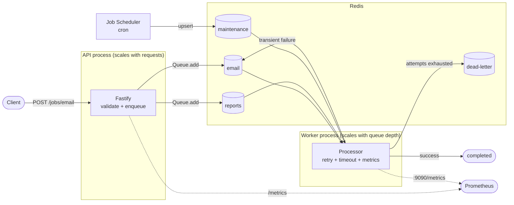

# queue-worker-kit

A production-ready **BullMQ + TypeScript** starter for background jobs: retries, dead-letter handling, observability, graceful shutdown, rate limiting, scheduling and Docker.

[](https://github.com/er95/queue-worker-kit/actions/workflows/ci.yml)
[](.nvmrc)
[](tsconfig.json)
[](LICENSE)

```bash
cp .env.example .env
docker compose up -d --build

curl -X POST http://localhost:3000/jobs/email \
  -H 'content-type: application/json' \
  -d '{"to":"user@example.com","template":"welcome","userId":"usr_123"}'
```

---

## Why

`new Worker(queue, handler)` is about ten lines. Everything that makes those ten lines survive contact with production is the other 90%:

| Concern                  | What goes wrong without it                                                               |
| ------------------------ | ---------------------------------------------------------------------------------------- |
| **Retries**              | A 500ms network blip permanently loses a job.                                            |
| **Retry classification** | An invalid payload burns five attempts and 30s of backoff to fail anyway.                |
| **Failure visibility**   | Terminal failures roll off the `failed` list; by morning there is nothing left to debug. |
| **Idempotency**          | A retried handler sends the same email twice.                                            |
| **Graceful shutdown**    | Every deploy abandons in-flight jobs to the stalled checker.                             |
| **Job retention**        | Completed jobs accumulate until Redis hits `maxmemory`.                                  |
| **Metrics**              | "Is the queue backed up?" has no answer.                                                 |
| **Health checks**        | A Redis blip either restarts every replica or is invisible.                              |

This kit standardises those decisions in one place. It does **not** wrap BullMQ or try to replace it: queues, workers and jobs are BullMQ's, and you are expected to read its docs.

---

## Features

- **BullMQ v6** with the current Job Scheduler API (no legacy `repeat`)
- **Separate API and worker processes**, the same image with different commands
- **Zod-validated** environment, HTTP requests and job payloads, at both producer and consumer
- **Retries** with native exponential backoff, plus explicit non-retryable errors
- **Dead-letter queue** that cannot loop, cannot duplicate, and stays bounded
- **Idempotency keys** mapped onto BullMQ deduplication
- **Correlation IDs** propagated from HTTP header to job to log line
- **Prometheus metrics** from both processes, with deliberately bounded label cardinality
- **Liveness and readiness** endpoints that answer different questions
- **Graceful shutdown** with ordered steps, a hard deadline and idempotent signal handling
- **Cooperative job timeouts** via `AbortSignal`
- **Bull Board** behind constant-time basic auth, opt-in
- **275 tests**, integration ones against a real Redis
- **Multi-stage Dockerfile**, non-root, production dependencies only

---

## Architecture



Two processes, on purpose. An API wants to drain in seconds and scales with request rate; a worker may need minutes to finish an in-flight job and scales with queue depth. Running workers inside the HTTP process couples those, and lets a slow job stall health checks.

More detail: [docs/architecture.md](docs/architecture.md).

---

## Quick start

**Docker (everything):**

```bash
cp .env.example .env
docker compose up -d --build
docker compose ps
```

**Local (Redis in Docker, apps on the host):**

```bash
cp .env.example .env
docker compose up -d redis

corepack enable          # pnpm comes from package.json's packageManager field
pnpm install
pnpm dev                 # API and worker together
```

Or in two terminals, which makes the logs easier to read:

```bash
pnpm dev:api
pnpm dev:worker
```

| URL                                | What                                   |
| ---------------------------------- | -------------------------------------- |
| http://localhost:3000              | API                                    |
| http://localhost:3000/health/live  | Liveness                               |
| http://localhost:3000/health/ready | Readiness                              |
| http://localhost:3000/metrics      | API metrics                            |
| http://localhost:9090/metrics      | Worker metrics                         |
| http://localhost:3000/admin/queues | Bull Board (off by default, see below) |

---

## Enqueue a job

```ts
const { id } = await enqueuer.enqueue('email.send', {
  to: 'user@example.com',
  template: 'welcome',
  userId: 'usr_123',
})
```

The job name is a union type, so the payload is checked at compile time _and_ validated with Zod before it reaches Redis. Options:

```ts
await enqueuer.enqueue('email.send', payload, {
  delay: 60_000, // run in a minute
  idempotencyKey: `welcome:${userId}`, // collapse repeat submissions
  correlationId: incomingTraceId, // propagate an upstream trace
  attempts: 3, // override the default
})
```

### Over HTTP

```bash
curl -X POST http://localhost:3000/jobs/email \
  -H 'content-type: application/json' \
  -d '{
    "to": "user@example.com",
    "template": "welcome",
    "userId": "usr_123"
  }'
# {"data":{"id":"1","name":"email.send","queue":"email"}}
```

```bash
curl http://localhost:3000/jobs/email/1
# {"data":{"id":"1","state":"completed","progress":0,"attemptsMade":1,
#          "correlationId":"...","result":{"delivered":true,...}}}
```

Validation failures are 4xx with the offending field:

```bash
curl -X POST http://localhost:3000/jobs/email \
  -H 'content-type: application/json' \
  -d '{"to":"nope","template":"welcome","userId":"u"}'
# 400 {"error":{"code":"VALIDATION_ERROR","message":"Invalid request",
#               "details":["to: must be a valid email address"]}}
```

| Endpoint               | Purpose                        |
| ---------------------- | ------------------------------ |
| `POST /jobs/email`     | Enqueue `email.send`           |
| `POST /jobs/report`    | Enqueue `report.generate`      |
| `POST /jobs/cleanup`   | Enqueue `maintenance.cleanup`  |
| `GET /jobs/:queue/:id` | Job state, progress and result |
| `GET /health/live`     | Liveness                       |
| `GET /health/ready`    | Readiness                      |
| `GET /metrics`         | Prometheus                     |

There is deliberately no HTTP route to pause, drain or obliterate a queue. Those are operator actions, not public API.

---

## Create a job definition

Four steps, one file:

```ts
// 1. Schema. The payload type is inferred from it, never written twice.
export const resizeImagePayloadSchema = z.object({
  imageId: z.string().min(1).max(64),
  width: z.number().int().min(1).max(4096),
})

// 2. Definition: canonical name, queue, schema.
export const resizeImageJob = defineJob<
  'image.resize',
  typeof resizeImagePayloadSchema,
  { imageId: string; bytes: number }
>({
  name: 'image.resize',
  queue: QUEUE_NAMES.images,
  schema: resizeImagePayloadSchema,
  defaultJobOptions: { attempts: 3 },
})

// 3. Processor. The logger already carries queue, jobId, jobName,
//    correlationId and attempt, so just log the message.
export function createResizeImageProcessor(
  storage: ImageStorage,
): JobProcessor<ResizeImagePayload, ResizeImageResult> {
  return async ({ data, logger, signal }) => {
    const bytes = await storage.resize(data.imageId, data.width, { signal })
    logger.info({ imageId: data.imageId }, 'image resized')
    return { imageId: data.imageId, bytes }
  }
}
```

Then register it in `src/jobs/registry.ts`:

```ts
const entries: readonly RegisteredJob[] = [
  // ...
  register(resizeImageJob, createResizeImageProcessor(storage)),
]
```

Add the queue name to `QUEUE_NAMES` and `WORKER_QUEUE_NAMES` in `src/config/defaults.ts`, and `'image.resize'` becomes a valid argument to `enqueue` with a fully typed payload.

---

## Reliability

### Retries

Defaults live in `src/config/defaults.ts` and `.env`, not scattered through call sites:

| Setting                | Default | Effect                              |
| ---------------------- | ------- | ----------------------------------- |
| `JOB_ATTEMPTS`         | `5`     | Total attempts, including the first |
| `JOB_BACKOFF_DELAY_MS` | `2000`  | Exponential base                    |

With those, waits between attempts are **2s → 4s → 8s → 16s**, using BullMQ's native `exponential` strategy. A definition can override (`report.generate` uses 3 attempts), and so can a single call.

### Retryable vs non-retryable

Retrying an invalid payload five times cannot make it valid. `NonRetryableError` extends BullMQ's own `UnrecoverableError`, so BullMQ fails the job immediately no matter how many attempts remain:

```ts
throw new NonRetryableError(`Unknown email template "${template}"`) // fails now
throw new TransientError('provider returned 502') // retried
```

Non-retryable: invalid payload, unknown job name, unsupported operation, a resource that is permanently gone. Retryable: timeouts, 5xx, dropped connections, anything transient. Payload validation failures are non-retryable automatically.

### Idempotency

**BullMQ is at-least-once. Your handlers will sometimes run twice.** A worker can die after sending an email but before reporting success, and the stalled checker will hand the job to another replica. That is not a bug to be fixed; it is the delivery guarantee.

An idempotency key collapses repeat _submissions_:

```ts
await enqueuer.enqueue('email.send', payload, {
  idempotencyKey: `welcome:${userId}`,
})
```

While the key is live (24h by default), a second call creates no new job and returns the existing job's id. That covers a double-clicked button or a retried webhook.

It does **not** make your handler idempotent. A queue cannot un-send an email that a previous attempt already sent. Real protection belongs at the business operation: a unique constraint, a conditional write, a provider-side idempotency key. See [docs/reliability.md](docs/reliability.md).

### Dead-letter queue

When attempts are exhausted, BullMQ leaves the job in the `failed` set, which `removeOnFail` eventually trims. The record you need at 3am is the one that rolled off yesterday, so terminal failures are copied into a dedicated `dead-letter` queue as a self-contained record:

```json
{
  "sourceQueue": "email",
  "sourceJobId": "42",
  "sourceJobName": "email.send",
  "payload": { "payload": { "to": "..." }, "meta": { "correlationId": "..." } },
  "failedReason": "NonRetryableError: Unknown email template \"nope\"",
  "error": { "name": "...", "message": "...", "stack": "..." },
  "attemptsMade": 5,
  "correlationId": "8af799ba-...",
  "failedAt": "2026-09-07T16:22:18.098Z"
}
```

Four properties, each deliberate:

- **No recursion.** Nothing consumes the dead-letter queue, and the writer refuses any job whose source queue _is_ the dead-letter queue.
- **No duplicates.** The record's job id is derived from the failure (`dlq-email-42-5`), so a repeated write is a Redis no-op.
- **No cascade.** A failed dead-letter write is logged and counted (`qwk_dead_letter_write_failures_total`), never rethrown. The job has already failed; failing the writer too would take the worker with it.
- **Bounded.** Records sit in `waiting` forever, so `removeOnFail` never applies to them. Past `DEAD_LETTER_MAX_ENTRIES` (5000), the oldest are evicted.

### Job timeouts

`JOB_TIMEOUT_MS` (30s) is a **cooperative** deadline. On expiry the job's `AbortSignal` fires and the attempt fails, which releases the concurrency slot. Node cannot forcibly terminate arbitrary async work, so a handler that ignores the signal keeps running to completion in the background. Pass the signal to `fetch` and check it between stages:

```ts
return async ({ data, signal }) => {
  const response = await fetch(url, { signal }) // aborts with the job
  throwIfAborted(signal) // between stages
}
```

### Graceful shutdown

SIGTERM and SIGINT run one ordered sequence. Handlers are idempotent, so the orchestrator sending both does not start two.

**Worker:** mark draining → `worker.close()` (stops fetching, **waits for active jobs**) → drain in-flight dead-letter writes → close metrics server → close event listeners → close queues → close Redis.

**API:** fail readiness and pause → `app.close()` (stops accepting, finishes in-flight requests) → close queues → close Redis.

Waiting for active jobs is what makes a rolling deploy safe: without it, in-flight work is abandoned and re-run by another replica once locks expire. A hard `SHUTDOWN_TIMEOUT_MS` deadline means shutdown can never hang, and `process.exit` is only ever called at the very end.

Keep your orchestrator's grace period above `SHUTDOWN_TIMEOUT_MS` (Compose uses `stop_grace_period: 40s`), or SIGKILL arrives first.

---

## Scaling

### Concurrency

`WORKER_CONCURRENCY` (10) is **per worker process**, not per cluster:

```
3 replicas x concurrency 10 = up to 30 jobs in flight
```

It suits I/O-bound work. A CPU-bound job blocks the event loop, which delays lock renewal and gets the job marked stalled; for genuinely CPU-heavy work use sandboxed processors, worker threads, or a different service. For a cluster-wide ceiling use `queue.setGlobalConcurrency()`.

### Rate limiting

```env
WORKER_RATE_LIMIT_MAX=100
WORKER_RATE_LIMIT_DURATION_MS=1000
```

Also per process, so three replicas allow ~300/s in aggregate. The interaction is worth stating plainly: **concurrency** caps jobs in flight at once, the **rate limit** caps jobs started per window, and **replicas** multiply both. For a real global limit use `queue.setGlobalRateLimit(max, duration)`.

### Scheduled jobs

BullMQ v6 removed legacy repeatable jobs, so `queue.add(name, data, { repeat: { cron } })` no longer exists. Recurring work uses **Job Schedulers**:

```ts
await queue.upsertJobScheduler(
  'maintenance-cleanup', // deterministic id
  { pattern: '0 * * * *' }, // hourly
  { name: 'maintenance.cleanup', data: envelope },
)
```

An upsert against a fixed id, so every replica calling it on boot converges on one schedule and a changed cron expression updates in place rather than leaving an orphan behind. Inspect and remove:

```ts
await queue.getJobSchedulers() // list
await queue.removeJobScheduler('maintenance-cleanup')
```

One caveat: the template is stored **once**, so a time-dependent payload field is fixed at upsert time and only refreshed when a worker reboots. For a rolling window, express it relatively and resolve it inside the processor.

### Delayed jobs

```ts
await enqueuer.enqueue('email.send', payload, { delay: 60_000 })
```

```bash
curl -X POST http://localhost:3000/jobs/email \
  -H 'content-type: application/json' \
  -d '{"to":"user@example.com","template":"welcome","userId":"usr_1","delay":60000}'
```

The job sits in `delayed` until it is due. Delays rely on producer and worker clocks agreeing.

---

## Observability

### Logs

Pino, structured, one stream for HTTP and jobs. Every job log line already carries its context:

```json
{
  "level": "info",
  "queue": "email",
  "jobId": "42",
  "jobName": "email.send",
  "correlationId": "8af799ba-...",
  "attempt": 1,
  "msg": "job started"
}
```

Lifecycle events logged: `job enqueued`, `job started`, `job completed`, `job failed`, `job failed, retrying`, `job moved to dead-letter`, `job stalled`, `worker ready`, `worker error`, `redis error`, `redis reconnecting`, `shutdown started`, `shutdown step complete`, `shutdown complete`.

Correlation IDs come from the `x-correlation-id` request header if present (echoed back), otherwise generated with `crypto.randomUUID()`, then carried through `AsyncLocalStorage` into the job envelope, the worker's logger, and the dead-letter record.

Authorization headers, cookies and passwords are redacted. Redis URLs are stripped of credentials before being logged (`redis://***@redis:6379`).

### Metrics

| Metric                                 | Type      | Labels              |
| -------------------------------------- | --------- | ------------------- |
| `qwk_jobs_enqueued_total`              | counter   | `queue`, `job_name` |
| `qwk_jobs_started_total`               | counter   | `queue`, `job_name` |
| `qwk_jobs_completed_total`             | counter   | `queue`, `job_name` |
| `qwk_jobs_failed_total`                | counter   | `queue`, `job_name` |
| `qwk_jobs_retrying_total`              | counter   | `queue`, `job_name` |
| `qwk_jobs_dead_lettered_total`         | counter   | `queue`, `job_name` |
| `qwk_jobs_stalled_total`               | counter   | `queue`             |
| `qwk_dead_letter_write_failures_total` | counter   | `queue`             |
| `qwk_job_duration_seconds`             | histogram | `queue`, `job_name` |
| `qwk_queue_jobs`                       | gauge     | `queue`, `state`    |

**Scrape both processes.** Enqueue counts and queue depth come from the API; everything about job execution is recorded where jobs run, so the worker serves its own `/metrics` on `WORKER_METRICS_PORT` (9090).

Labels are `queue` and `job_name` only. Job ids, user ids and correlation ids are deliberately absent: each would mint a new time series per job and eventually take Prometheus down. Queue depth is sampled at scrape time, and only by the API, so replicas do not all publish the same numbers.

### Bull Board

Off by default, mounted at `/admin/queues` behind basic auth with constant-time credential comparison. It is a privileged control surface: it can retry, remove and drain queues, so there is deliberately no committed default password: a password in a public repository is a public password. Enable it in `.env`, which Compose reads too:

```env
ENABLE_BULL_BOARD=true
BULL_BOARD_USERNAME=ops
BULL_BOARD_PASSWORD=a-long-random-value
```

Config validation refuses to start in production with a missing, short, or well-known example password. Basic auth still transmits the password in cleartext, so terminate TLS in front of it, and prefer an authenticated proxy for anything shared.

> Repository owner: to add a dashboard screenshot, drop a PNG in `docs/` and link it here.

---

## Health checks

Two endpoints answering two different questions, because conflating them causes outages.

| Endpoint            | Question                                | Checks Redis?          | On failure                     |
| ------------------- | --------------------------------------- | ---------------------- | ------------------------------ |
| `GET /health/live`  | Is this process broken beyond recovery? | **No**                 | Container is killed            |
| `GET /health/ready` | Should traffic come here right now?     | Yes, with a 1s timeout | Removed from the load balancer |

If liveness checked Redis, a brief Redis blip would restart every API replica at once, turning a recoverable dependency failure into a full outage. Readiness also fails as soon as draining begins, so the load balancer stops routing before the server actually closes.

```bash
curl http://localhost:3000/health/ready
# 200 {"status":"ok","checks":{"redis":true}}
# 503 {"status":"not_ready","checks":{"redis":false}}
```

**When Redis is down:** the API still starts and serves liveness, readiness reports 503, and enqueue requests **fail fast** with a 5xx rather than hanging (the producer connection sets `enableOfflineQueue: false`). Workers use the opposite setting, buffering across a blip, and resume as soon as ioredis reconnects.

---

## Docker

```bash
docker compose up -d --build      # or: pnpm docker:up
docker compose ps
docker compose logs -f worker     # or: pnpm docker:logs
docker compose down               # or: pnpm docker:down
```

```bash
docker compose up -d --scale worker=3    # more workers
```

One multi-stage image runs both processes with different commands, so they cannot drift apart between deploys. The runtime stage has production dependencies only, runs as the non-root `node` user, and health-checks itself through the real health endpoint using Node's global `fetch` (no curl or wget in the image). Redis is health-checked with `redis-cli ping`, and the app containers wait for it to be _healthy_, not merely started.

Containers reach Redis at `redis://redis:6379`, its service DNS name. Inside a container, `localhost` is the container itself.

Published ports are bound to `127.0.0.1`, so the local stack is not reachable from the network. Docker's default (`0.0.0.0`) also bypasses host firewall rules, which is an unwelcome surprise on a cloud VM. Change them when you actually intend to serve external traffic.

Redis publishes no host port at all, since the app reaches it over the container network and many machines already run a Redis on 6379. To poke at it:

```bash
docker compose exec redis redis-cli
docker compose exec redis redis-cli --scan --pattern 'qwk:*' --count 100 | head
```

---

## Configuration

Everything is validated at boot with Zod. Invalid values fail the process instead of silently becoming a default, and error messages never echo the offending value, since `REDIS_URL` routinely carries a password.

| Variable                        | Default                  | Description                                         |
| ------------------------------- | ------------------------ | --------------------------------------------------- |
| `NODE_ENV`                      | `development`            | `development` \| `test` \| `production`             |
| `HOST`                          | `0.0.0.0`                | API bind address                                    |
| `PORT`                          | `3000`                   | API port                                            |
| `REDIS_URL`                     | `redis://localhost:6379` | Must be `redis://` or `rediss://`                   |
| `LOG_LEVEL`                     | `info`                   | `trace`…`fatal`, or `silent`                        |
| `LOG_PRETTY`                    | on outside production    | Human-readable logs (dev only)                      |
| `QUEUE_PREFIX`                  | `qwk`                    | Namespaces every Redis key                          |
| `WORKER_CONCURRENCY`            | `10`                     | Parallel jobs **per process**                       |
| `JOB_ATTEMPTS`                  | `5`                      | Total attempts, including the first                 |
| `JOB_BACKOFF_DELAY_MS`          | `2000`                   | Exponential backoff base                            |
| `JOB_REMOVE_ON_COMPLETE_COUNT`  | `1000`                   | Completed jobs retained per queue                   |
| `JOB_REMOVE_ON_FAIL_COUNT`      | `5000`                   | Failed jobs retained per queue                      |
| `DEAD_LETTER_MAX_ENTRIES`       | `5000`                   | Dead-letter records before oldest are evicted       |
| `WORKER_RATE_LIMIT_MAX`         | `100`                    | Jobs per window, **per process**                    |
| `WORKER_RATE_LIMIT_DURATION_MS` | `1000`                   | Rate limit window                                   |
| `JOB_TIMEOUT_MS`                | `30000`                  | Cooperative per-attempt deadline                    |
| `SHUTDOWN_TIMEOUT_MS`           | `30000`                  | Hard graceful-shutdown deadline                     |
| `ENABLE_JOB_SCHEDULERS`         | `true`                   | Workers upsert recurring schedules on boot          |
| `MAINTENANCE_CLEANUP_CRON`      | `0 * * * *`              | 5- or 6-field cron                                  |
| `ENABLE_QUEUE_EVENTS`           | `true`                   | QueueEvents logging (+1 Redis connection per queue) |
| `ENABLE_WORKER_METRICS_SERVER`  | `true`                   | Worker `/metrics` and `/health/live`                |
| `WORKER_METRICS_HOST`           | `0.0.0.0`                | Worker metrics bind address                         |
| `WORKER_METRICS_PORT`           | `9090`                   | Worker metrics port                                 |
| `ENABLE_BULL_BOARD`             | `false`                  | Mount the dashboard                                 |
| `BULL_BOARD_USERNAME`           | none                     | Required when the dashboard is on                   |
| `BULL_BOARD_PASSWORD`           | none                     | Required when on; ≥16 chars in production           |

No variable is required: every default above is what the app already uses.

---

## Testing

```bash
pnpm test              # everything
pnpm test:unit         # pure logic, no Redis
pnpm test:integration  # needs a real Redis
pnpm test:coverage
```

Integration tests need Redis. The default is `redis://127.0.0.1:6380`, overridable with `TEST_REDIS_URL`:

```bash
docker run -d --name qwk-test-redis -p 6380:6379 redis:8.2-alpine
pnpm test:integration
```

**Unit tests** cover environment parsing, payload validation, error serialization, retry classification, the job registry, correlation IDs, metric cardinality and shutdown ordering.

**Integration tests run against a real Redis, never a mock.** Every property worth testing here (backoff timing, deduplication TTLs, delayed-set promotion, terminal-failure bookkeeping) lives in BullMQ's Lua scripts, and a mock would only assert that the mock behaves as assumed. They cover enqueue-and-process, validation at both boundaries, retry-then-succeed, backoff growth, terminal failure reaching the DLQ, DLQ recursion refusal, DLQ deduplication and eviction, delayed jobs, idempotency, job schedulers, timeouts, shutdown draining, health and readiness (including with Redis unreachable), and dashboard auth.

Each suite gets its own queue prefix (`qwk:test:<label>:<random>`) and closes every worker, queue, listener and connection it opens. Vitest exits on its own; there is no `--force-exit` hiding a leaked handle. Waiting uses polling helpers with explicit deadlines rather than fixed sleeps, which is the usual source of flaky queue tests.

---

## Production notes

**Redis is your durable job store, not a cache.** Configure it accordingly:

- **`maxmemory-policy noeviction`.** Any `allkeys-*` policy lets Redis delete job keys under pressure, silently losing queued work. Rejecting writes is the correct failure mode; see BullMQ's own production recommendations.
- **Persistence** (AOF and/or RDB) plus real backups, since queued jobs are state you cannot reconstruct.
- **HA/failover** (Sentinel or a managed service). BullMQ Cluster support exists but needs care with key slots.
- **Auth and TLS** (`rediss://`). Never log the URL unredacted.
- **Monitor** memory, evictions, connections and blocked clients.

**Also worth knowing:**

- **Retention.** Bound `JOB_REMOVE_ON_COMPLETE_COUNT` / `JOB_REMOVE_ON_FAIL_COUNT`. Unbounded retention is the most common way BullMQ deployments run Redis out of memory. The dead-letter queue needs its own policy because nothing consumes it.
- **Idempotency.** At-least-once means handlers run twice sometimes. Deduplicate at the business operation, not just the queue.
- **CPU-heavy jobs.** They block the event loop, delay lock renewal, and get marked stalled. Use sandboxed processors, worker threads, or a separate service.
- **Metric cardinality.** Never label a metric with a job id, user id or correlation id.
- **Bull Board.** Off unless needed, behind TLS and ideally an authenticated proxy. It can drain your queues.
- **Connections.** One shared client per process, plus one blocking connection per worker and per QueueEvents instance. Budget accordingly with many replicas.
- **Clock skew.** Delayed jobs and cron schedules assume producer and worker clocks roughly agree.

More: [docs/operations.md](docs/operations.md) and [docs/reliability.md](docs/reliability.md).

---

## Project structure

```
src/
├── api/                 # Fastify producer: routes, error mapping, Bull Board
├── config/              # env.ts (Zod-validated) and defaults.ts (constants)
├── errors/              # NonRetryableError and retry classification
├── jobs/
│   ├── definitions/     # one file per job: schema + processor
│   ├── registry.ts      # the closed set of known jobs
│   └── types.ts         # defineJob, envelope, ProcessorContext
├── observability/       # logger, metrics, correlation context
├── queue/               # connection, queue factory + registry, enqueue, scheduler
├── worker/              # worker factory, processor wrapper, DLQ, shutdown
└── index.ts             # public exports

tests/{unit,integration,helpers}
docs/{architecture,reliability,operations}.md
```

Two rules hold throughout: no module opens a Redis connection as an import side effect, and nothing is registered by importing a file. Dependencies are created in `src/api/server.ts` and `src/worker/server.ts` and passed down, which is what keeps the rest testable.

---

## License

[MIT](LICENSE)
