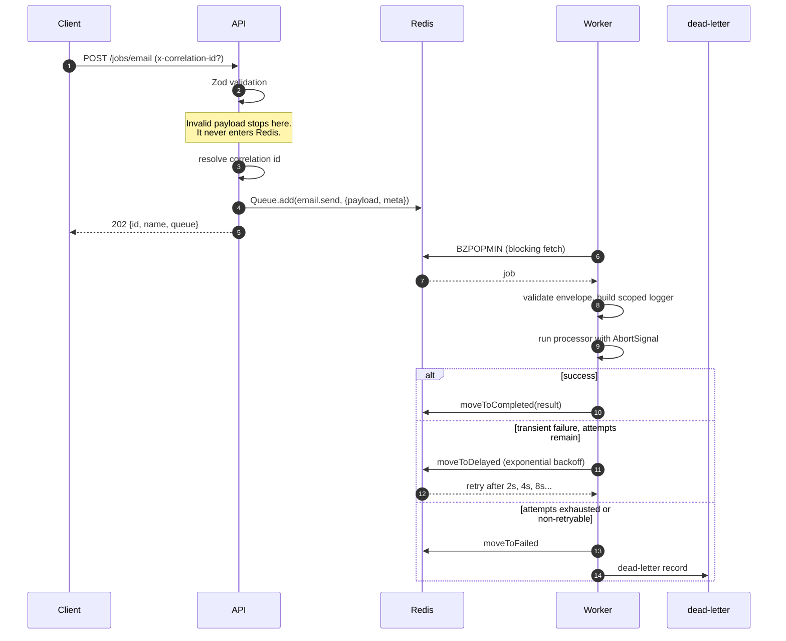

# Architecture

How the pieces fit together and why they are split the way they are. The README covers usage; this covers structure.

## Processes

Two long-running processes, sharing one image and one codebase.

|             | API (`src/api/server.ts`)                             | Worker (`src/worker/server.ts`)                     |
| ----------- | ----------------------------------------------------- | --------------------------------------------------- |
| Role        | Producer                                              | Consumer                                            |
| Serves      | HTTP: enqueue, job status, health, metrics, dashboard | HTTP: metrics and liveness only                     |
| Scales with | Request rate                                          | Queue depth                                         |
| Drains in   | Seconds                                               | As long as the longest in-flight job                |
| Owns        | One Redis client                                      | One Redis client, plus BullMQ's blocking duplicates |

They are separate because those columns disagree. An API replica should leave rotation and exit quickly; a worker replica must be allowed to finish a 90-second job before the container dies, or that job gets abandoned and re-run elsewhere. Merging them forces one shutdown budget on both, and lets a CPU-heavy job stall the event loop that health checks depend on.

Neither process is a singleton in code: `buildApp()` and the worker bootstrap take their dependencies as arguments, so a test constructs the same objects without binding a port or reading `process.env`.

## Request and job flow



## The job envelope

Everything in Redis is `{ payload, meta }`:

```ts
{
  payload: { to: 'user@example.com', template: 'welcome', userId: 'usr_123' },
  meta: {
    correlationId: '8af799ba-...',
    enqueuedAt: '2026-09-07T16:22:02.437Z',
    idempotencyKey: 'welcome:usr_123',   // optional
  },
}
```

Transport metadata is kept out of the business payload for two reasons: a correlation id does not belong in a domain type, and metadata can gain fields without touching any job's schema. The worker validates the envelope and the payload as two separate steps, so "this job is malformed" and "this payload is malformed" produce different error messages.

## Module layout

```
src/
├── config/
│   ├── env.ts            Zod schema over process.env. Fails the process on
│   │                     invalid input; never echoes values into errors.
│   └── defaults.ts       Every operational constant not worth an env var:
│                         queue names, histogram buckets, lock durations.
├── errors/errors.ts      NonRetryableError (extends BullMQ's
│                         UnrecoverableError) and retry classification.
├── utils/
│   ├── serialize-error.ts  Unknown thrown value -> loggable object.
│   └── sleep.ts            Abort-aware setTimeout.
├── observability/
│   ├── logger.ts         Pino, with redaction paths.
│   ├── metrics.ts        A fresh prom-client Registry per call.
│   └── context.ts        AsyncLocalStorage correlation id.
├── jobs/
│   ├── types.ts          defineJob, the envelope, ProcessorContext.
│   ├── definitions/      One file per job: schema, definition, processor.
│   └── registry.ts       The closed set of known jobs.
├── queue/
│   ├── connection.ts     Redis client lifecycle and URL redaction.
│   ├── defaults.ts       buildDefaultJobOptions / buildWorkerOptions.
│   ├── create-queue.ts   Queue factory.
│   ├── registry.ts       Name -> Queue, fixed at bootstrap.
│   ├── enqueue.ts        Validate, stamp metadata, add, log, count.
│   ├── scheduler.ts      Job Scheduler upserts.
│   └── events.ts         QueueEvents, for logging only.
├── worker/
│   ├── create-worker.ts    Worker + event wiring.
│   ├── processor.ts        The wrapper every job runs inside.
│   ├── dead-letter.ts      Terminal failure records.
│   ├── metrics-server.ts   The worker's /metrics and /health/live.
│   └── graceful-shutdown.ts  Ordered steps, deadline, signal handling.
└── api/
    ├── app.ts            Fastify assembly.
    ├── errors.ts         Error -> status code and safe JSON body.
    ├── bull-board.ts     Dashboard behind basic auth.
    └── routes/           jobs, health, metrics.
```

Two invariants hold everywhere:

1. **No connection on import.** No module opens a socket as an import side effect. Connections are created in a bootstrap and passed down, which is what makes the rest testable and startup order predictable.
2. **No registration by import.** The job registry is a plain object, not something files append to when loaded. Job names are a union type rather than `string`.

## Redis connections

BullMQ v6 made its backend pluggable: it no longer depends on a Redis client, and `pg`, `redis` and `ioredis` are optional peers. This kit installs `ioredis` and passes a _client instance_, which has a specific consequence worth knowing.

- Pass a **client instance**: BullMQ marks the connection `shared` and will not close it. The creator must.
- Pass **options** instead: BullMQ creates and owns a client **per Queue, Worker and QueueEvents**, quietly multiplying connections.

So each process creates exactly one client and hands the instance to every Queue and Worker. BullMQ still duplicates it where a blocking command needs a dedicated socket, and closes those duplicates itself.

Per worker process, with three queues:

| Connection                          | Count            | Owner                                      |
| ----------------------------------- | ---------------- | ------------------------------------------ |
| Shared client                       | 1                | This kit (closed in the shutdown sequence) |
| Worker blocking fetch (`BZPOPMIN`)  | 1 per worker (3) | BullMQ                                     |
| QueueEvents blocking read (`XREAD`) | 1 per queue (3)  | BullMQ                                     |

That is 7 with `ENABLE_QUEUE_EVENTS=true`, or 4 without. Multiply by replicas when sizing a managed Redis connection limit.

The two roles are configured differently on purpose:

| Option                 | Producer | Worker | Why                                                                                                                |
| ---------------------- | -------- | ------ | ------------------------------------------------------------------------------------------------------------------ |
| `maxRetriesPerRequest` | `null`   | `null` | Required by BullMQ for blocking commands; also stops commands failing mid-reconnect                                |
| `enableOfflineQueue`   | `false`  | `true` | An HTTP caller would rather get a 503 now than have its request buffered indefinitely. A worker wants the opposite |

## Observability topology

Metrics are recorded where the event happens, which means **both processes must be scraped**:

| Process | Reports                                                                                       |
| ------- | --------------------------------------------------------------------------------------------- |
| API     | `qwk_jobs_enqueued_total`, `qwk_queue_jobs` (sampled at scrape)                               |
| Worker  | started / completed / failed / retrying / dead-lettered / stalled, `qwk_job_duration_seconds` |

Two details that are easy to get wrong:

- **Queue depth is only reported by the API.** It is a property of the queue, not of a process, so having every worker report it would publish identical series N times and add a Redis round trip per replica per scrape.
- **The stalled counter comes from the worker's own `stalled` event, not from QueueEvents.** QueueEvents is a _broadcast_ stream: every listener in the fleet sees every event, so a counter derived from it would be multiplied by replica count the moment anyone summed it. That is why `src/queue/events.ts` is used for logging only.

## Scaling model

```
throughput ceiling ~= replicas x concurrency, bounded by the rate limiter
```

Both `WORKER_CONCURRENCY` and the rate limiter are **per process**. Three replicas at concurrency 10 run up to 30 jobs at once, and each gets its own 100/s budget. For cluster-wide ceilings, BullMQ offers `queue.setGlobalConcurrency()` and `queue.setGlobalRateLimit()`.

Scaling assumes I/O-bound work. A CPU-bound job blocks the event loop, which delays lock renewal and eventually gets the job marked stalled: see [reliability.md](reliability.md).
